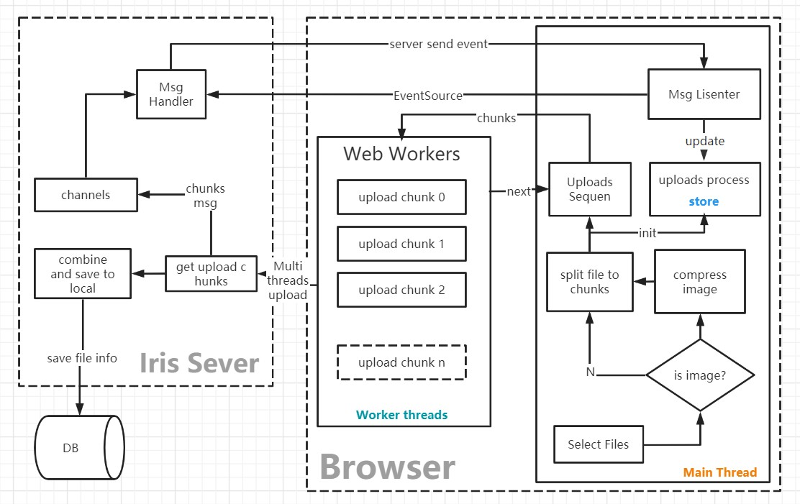

### Project struct
| database | ORM |  api | web |
|------------|--------|--------------|----|
|sqlit | gorm | iris | sveltejs kit|

### todo:
###### Functions:
- [x] Sign in and Sign out
- [ ] posts , tags , tag, page content
- [ ]  write a article   
    - [ ]  set public or draft  
    - [ ]  add res  
    - [ ]  pwd  
    - [ ]  seo field 
- [ ] comments 
    - [ ] create and list
    - [ ] firewall
- [ ] resources manage    
  - [ ] file share 
- [ ] front-end img compress
###### UI  
- [ ] front-end ui
###### Deploy
- [ ] move frontend to vercel 
- [ ] move backend to vultr 
 

### Upload Files Architecture
-  split file to multiple chunk then upload though web worker
-  combine chunk to file in server then save file info to db

